# Nuwa

## Start for the prototype system

```code
npm i
npm run start
```

-   Data Selection
    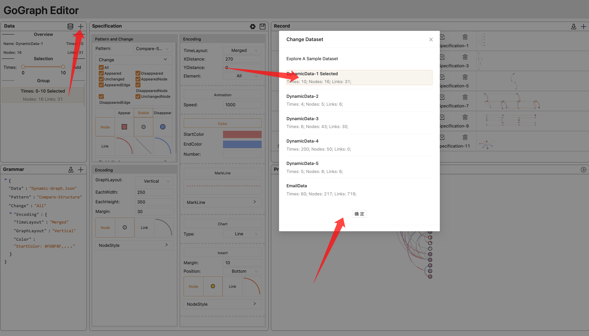

-   Record
    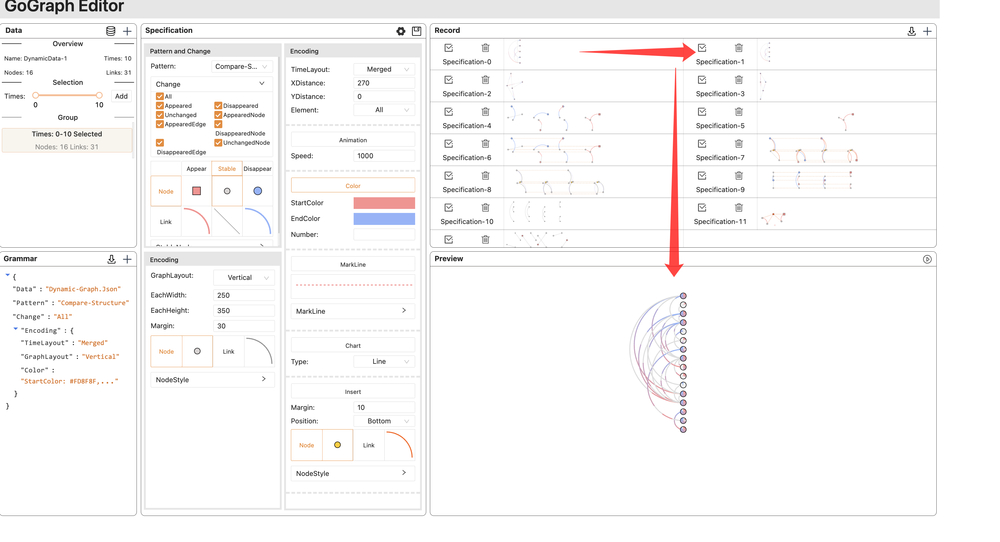

-   Pattern
    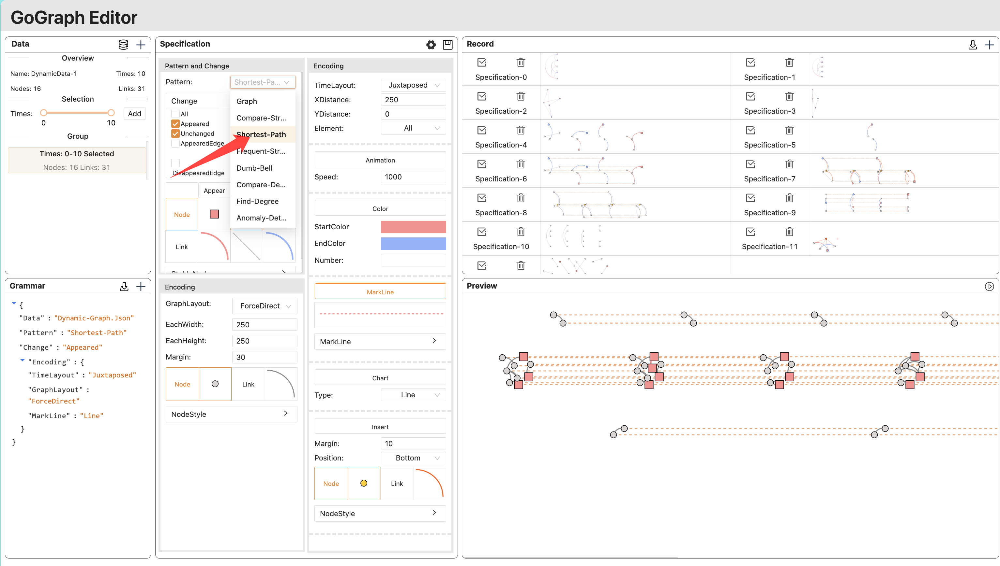
-   Encoding
    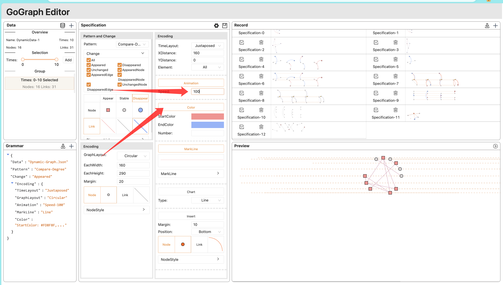

## Description

The specification of Nuwa consists of four major primitives _data_, _entity_, _change_, and _encoding_, which are abstracted from concepts of typical graph models.

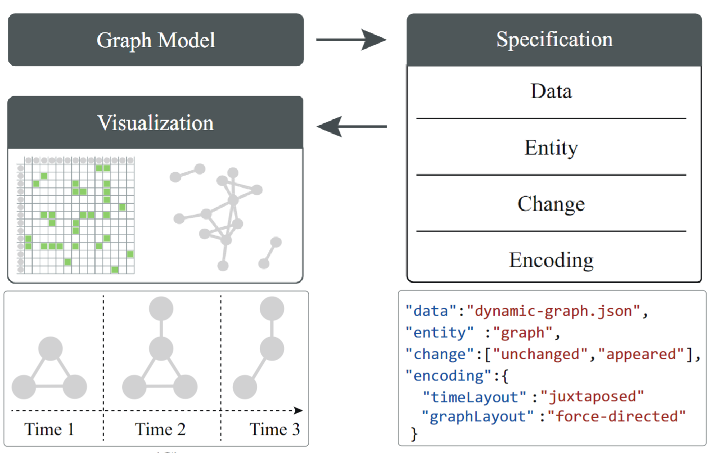

## Gallery

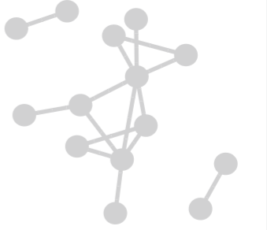

```json
{
    "data": "graph.json",
    "entity": "graph",
    "change": ["unchanged", "appeared"],
    "encoding": {
        "graphLayout": "force-directed",
        "timeLayout": "merged"
    }
}
```

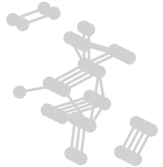

```json
{
    "data": "graph.json",
    "entity": "graph",
    "change": ["unchanged", "appeared"],
    "encoding": {
        "graphLayout": "force-directed",
        "timeLayout": {
            "x": 3,
            "y": 3
        }
    }
}
```

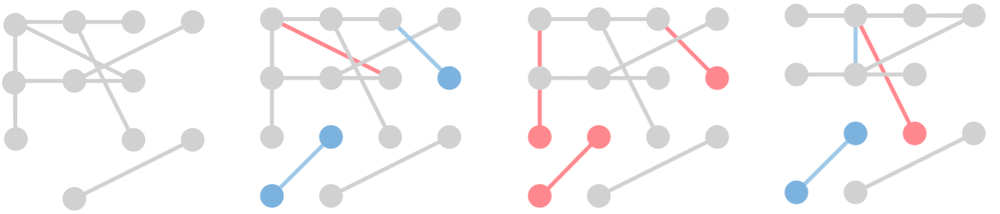

```json
{
    "data": "graph.json",
    "entity": "graph",
    "change": "all",
    "encoding": {
        "graphLayout": "grid",
        "timeLayout": "juxtaposed",
        "color": "change"
    }
}
```

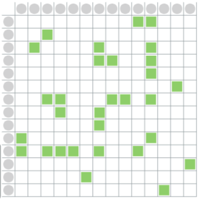

```json
{
    "data": "graph.json",
    "entity": "graph",
    "change": ["unchanged", "appeared"],
    "encoding": {
        "graphLayout": "matrix",
        "timeLayout": "merged"
    }
}
```

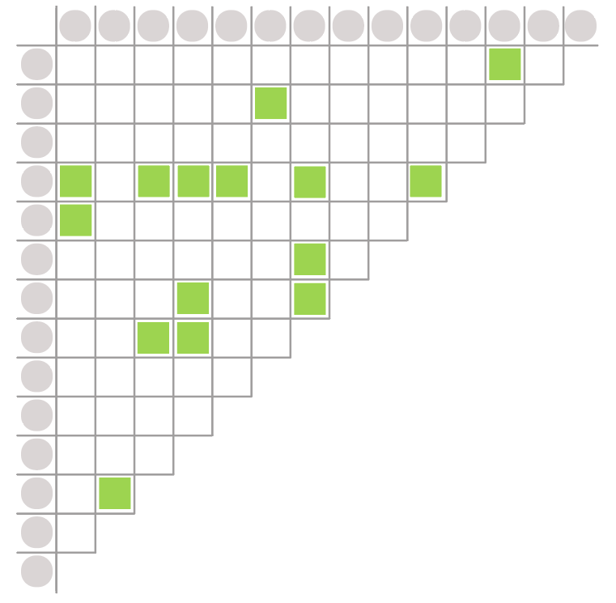

```json
{
    "data": "graph.json",
    "entity": "graph",
    "change": ["unchanged", "appeared"],
    "encoding": {
        "graphLayout": "square-matrix",
        "timeLayout": "merged"
    }
}
```

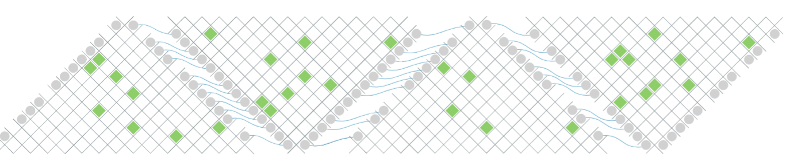

```json
{
    "data": "graph.json",
    "entity": "graph",
    "combination": [
        {
            "change": ["unchanged", "appeared"],
            "encoding": {
                "graphLayout": "square-matrix(time % 4 * 45)",
                "timeLayout": "juxtaposed"
            }
        },
        {
            "change": "unchangedNode",
            "encoding": {
                "markLins": "curve"
            }
        }
    ]
}
```

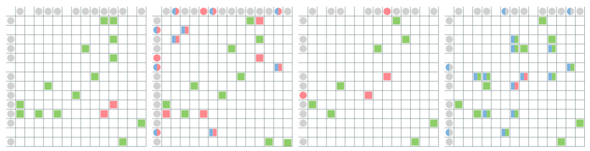

```json
{
    "data": "graph.json",
    "combination": [
        {
            "entity": "graph",
            "change": "all",
            "encoding": {
                "graphLayout": "matrix",
                "timeLayout": "juxtaposed"
            }
        },
        {
            "entity": "links",
            "change": ["all", "disappear(frame='next')"],
            "encoding": {
                "color": "change"
            }
        }
    ]
}
```

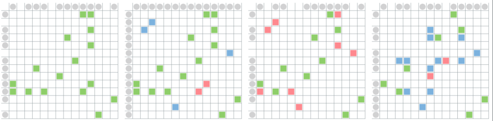

```json
{
    "data": "graph.json",
    "combination": [
        {
            "entity": "graph",
            "change": "all",
            "encoding": {
                "graphLayout": "matrix",
                "timeLayout": "juxtaposed"
            }
        },
        {
            "entity": "links",
            "change": "all",
            "encoding": {
                "color": "change"
            }
        }
    ]
}
```

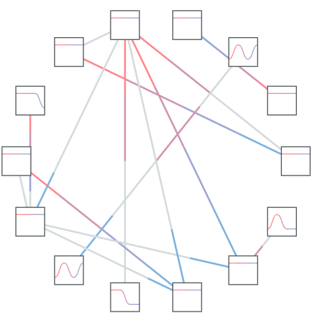

```json
{
    "data": "graph.json",
    "entity": "graph",
    "combination": [
        {
            "change": "all",
            "encoding": {
                "timeLayout": "merged",
                "graphLayout": "circular",
                "color": {
                    "field": "time",
                    "scale": "ordinal"
                }
            }
        },
        {
            "change": ["unchangedNode", "appearNode", "disappearNode"],
            "encoding": {
                "chart": {
                    "name": "lineChart",
                    "field": "change==disappeared?0:1",
                    "scale": "bin-ordinal"
                }
            }
        }
    ]
}
```

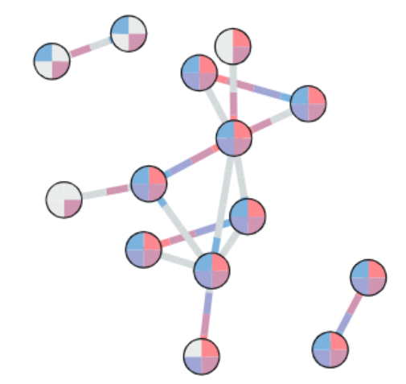

```json
{
    "data": "graph.json",
    "entity": "graph",
    "combination": [
        {
            "change": "all",
            "encoding": {
                "timeLayout": "merged",
                "graphLayout": "force-directed",
                "color": {
                    "field": "time",
                    "scale": "ordinal"
                }
            }
        },
        {
            "change": ["unchangedNode", "appearNode", "disappearNode"],
            "encoding": {
                "chart": {
                    "name": "pieChart",
                    "field": "time",
                    "scale": "ordinal"
                }
            }
        }
    ]
}
```

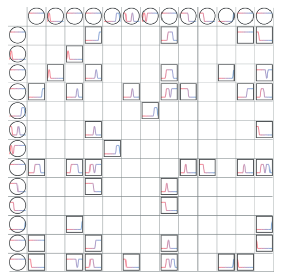

```json
{
    "data": "graph.json",
    "entity": "graph",
    "change": "all",
    "encoding": {
        "graphLayout": "matrix",
        "timeLayout": "merged",
        "chart": {
            "name": "lineChart",
            "field": "change==disappeared?0:1",
            "scale": "bin-ordinal"
        }
    }
}
```

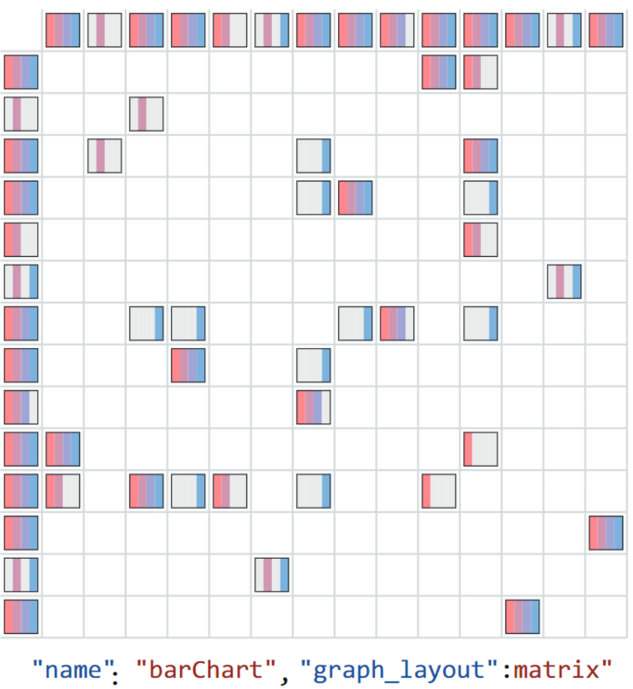

```json
{
    "data": "graph.json",
    "entity": "graph",
    "change": "all",
    "encoding": {
        "graphLayout": "matrix",
        "timeLayout": "merged",
        "chart": {
            "name": "barChart",
            "field": "time",
            "scale": "ordinal"
        }
    }
}
```

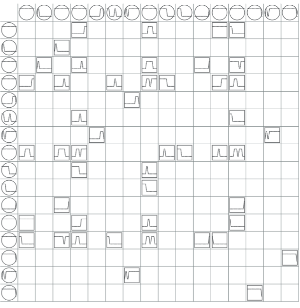

```json
{
    "data": "graph.json",
    "entity": "graph",
    "change": "all",
    "encoding": {
        "graphLayout": "matrix",
        "timeLayout": "merged",
        "chart": {
            "name": "linechart",
            "field": "change==disappeared?0:1",
            "scale": "bin-ordinal"
        }
    }
}
```

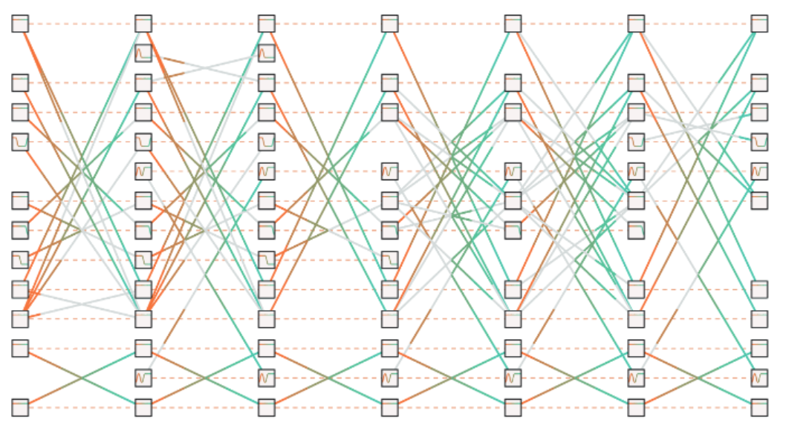

```json
{
    "data": "graph.json",
    "entity": "graph",
    "combination": [
        {
            "change": ["appeared", "disappeared"],
            "encoding": {
                "timeLayout": "juxtaposed",
                "graphLayout": "bipartite",
                "color": {
                    "field": "time",
                    "scale": "quantitative"
                }
            }
        },
        {
            "change": ["unchangedNode", "appearedNode"],
            "encoding": {
                "chart": {
                    "name": "lineChart",
                    "field": "change==disappeared?0:1",
                    "scale": "bin-ordinal"
                },
                "markLine": "dotted"
            }
        }
    ]
}
```

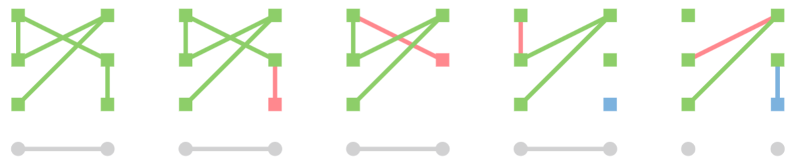

```json
{
    "data": "graph.json",
    "combination": [
        {
            "entity": "graph",
            "change": ["unchanged", "appeared"],
            "encoding": {
                "timeLayout": "juxtaposed",
                "graphLayout": "grid"
            }
        },
        {
            "entity": "shortestPath(start='A', end='E', time='1')",
            "change": "unchanged",
            "encoding": {
                "color": "green"
            }
        }
    ]
}
```


```json
{
    "data": "graph.json",
    "combination": [
        {
            "entity": "graph",
            "change": ["unchanged", "appeared"],
            "encoding": {
                "timeLayout": "juxtaposed",
                "graphLayout": "circular",
                "link": "curve"
            }
        },
        {
            "entity": "shortestPath(start='A', end='E', time='1')",
            "change": "unchanged",
            "encoding": {
                "color": "green"
            }
        }
    ]
}
```

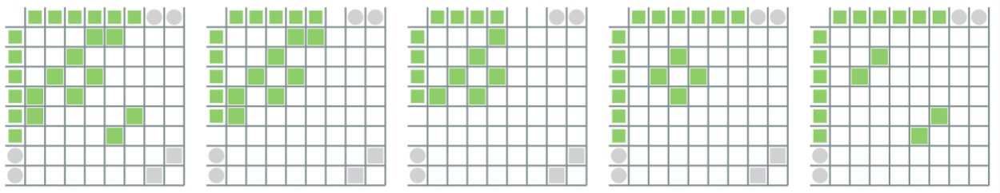

```json
{
    "data": "graph.json",
    "combination": [
        {
            "entity": "graph",
            "change": ["unchanged", "appeared"],
            "encoding": {
                "timeLayout": "juxtaposed",
                "graphLayout": "matrix"
            }
        },
        {
            "entity": "shortestPath(start='A', end='E', time='1')",
            "change": "unchanged",
            "encoding": {
                "color": "green"
            }
        }
    ]
}
```

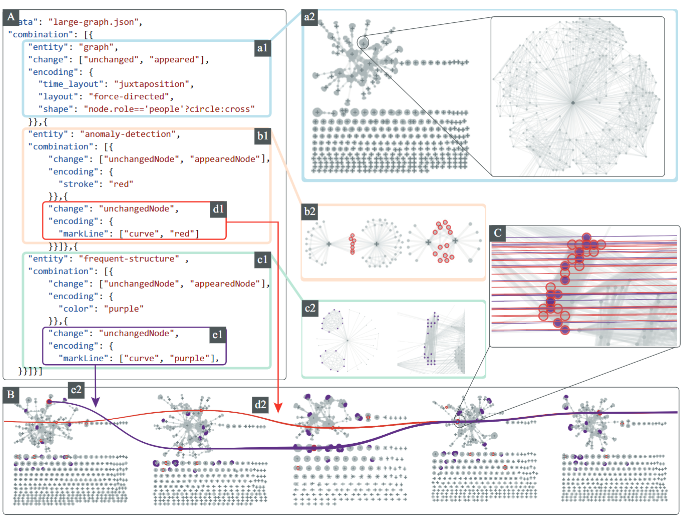

```json
{
    "data": "large-dynamic.json",
    "combination": [
        {
            "entity": "graph",
            "change": ["unchanged", "appeared"],
            "encoding": {
                "timeLayout": "juxtaposed",
                "graphLayout": "force-directed",
                "shape": "node.role=='people'?circle:cross"
            }
        },
        {
            "entity": "frequent-structure",
            "combination": [
                {
                    "change": ["unchangedNode", "appearedNode"],
                    "encoding": {
                        "color": "red"
                    }
                },
                {
                    "change": "unchangedNode",
                    "encoding": {
                        "markLine": {
                            "name": "curve",
                            "color": "red"
                        }
                    }
                }
            ]
        },
        {
            "entity": "anomaly-detection",
            "combination": [
                {
                    "change": ["unchangedNode", "appearedNode"],
                    "encoding": {
                        "color": "purple"
                    }
                },
                {
                    "change": "unchangedNode",
                    "encoding": {
                        "markLine": ["curve", "purple"]
                    }
                }
            ]
        }
    ]
}
```

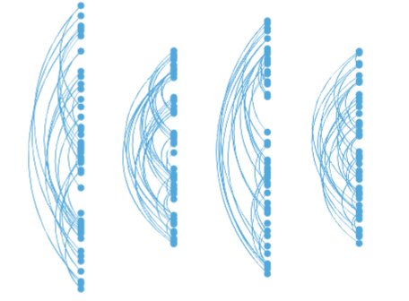

```json
{
    "data": "graph.json",
    "entity": "graph",
    "change": ["unchanged", "appeared"],
    "encoding": {
        "graphLayout": "force-directed",
        "timeLayout": "juxtaposed",
        "link": "curve"
    }
}
```

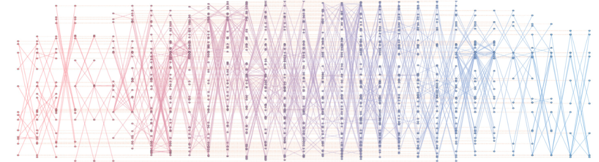

```json
{
    "data": "graph.json",
    "entity": "graph",
    "change": ["unchanged", "appeared"],
    "encoding": {
        "graphLayout": "Bipartite",
        "timeLayout": "juxtaposed",
        "color": "change",
        "markLine": "line"
    }
}
```

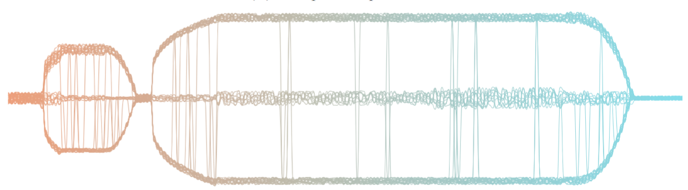

```json
{
    "data": "graph.json",
    "entity": "graph",
    "change": ["unchanged", "appeared"],
    "encoding": {
        "graphLayout": "one-MDS",
        "timeLayout": "juxtaposed",
        "markLine": {
            "type": "line",
            "color": "time"
        },
        "show": false
    }
}
```

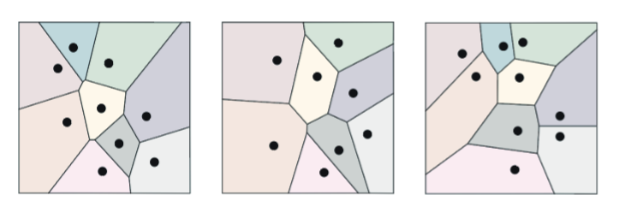

```json
{
    "data": "graph.json",
    "entity": "graph",
    "change": ["unchanged", "appeared"],
    "encoding": {
        "graphLayout": "MDS",
        "timeLayout": "juxtaposed",
        "shape": "Voronoi",
        "color": "id",
        "animation": 300
    }
}
```

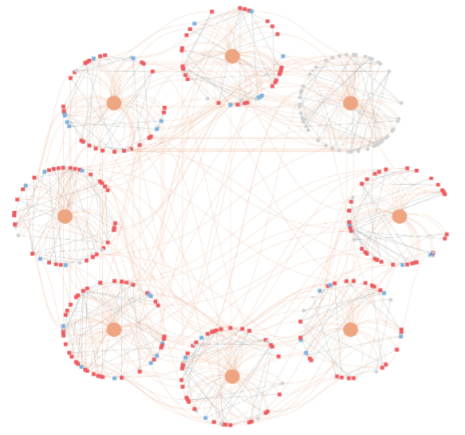

```json
{
    "data": "graph.json",
    "combination": [
        {
            "entity": "graph",
            "change": "all",
            "encoding": {
                "graphLayout": "circular",
                "timeLayout": "circular"
            }
        },
        {
            "entity": ["unchangedNode", "appearedNode", "disappearNode"],
            "change": "all",
            "encoding": {
                "color": "change",
                "markLine": "curve",
                "timeInsert": {
                    "connect": "node",
                    "type": "curve"
                }
            }
        }
    ]
}
```
